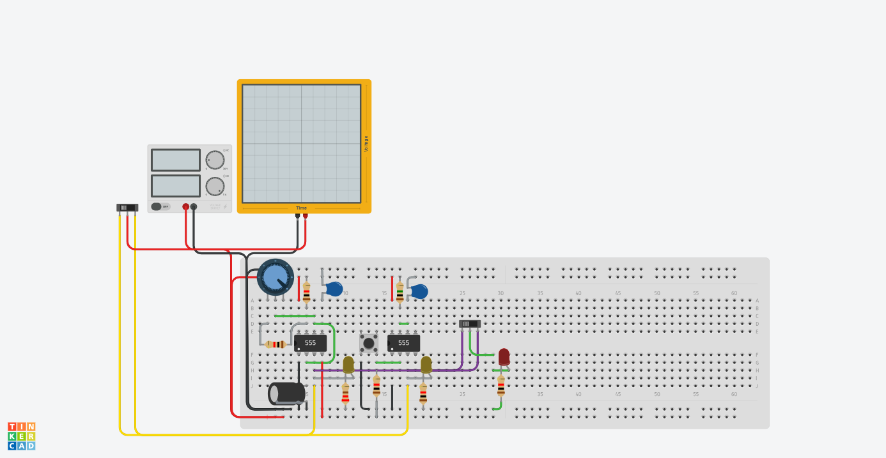
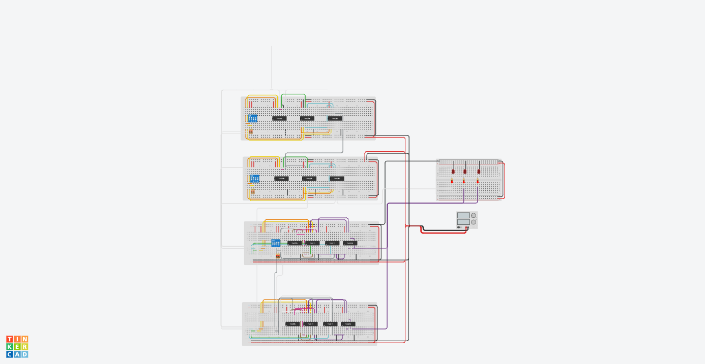
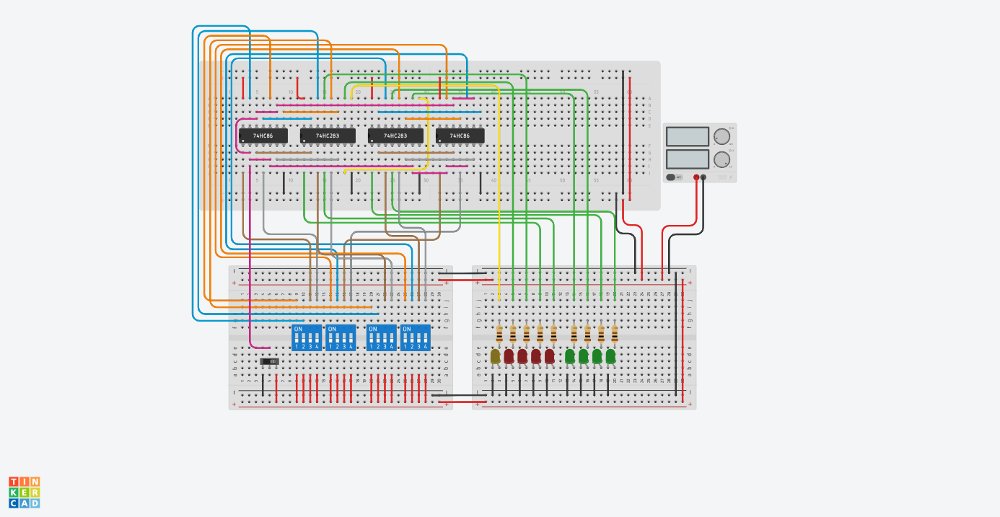

#  Projeto: Arquitetura e Simulação de CPU e ULA (8-Bits)
Link do video: https://www.youtube.com/watch?v=Ijn7x_YQMOY

##  Resumo do Projeto
Este projeto consiste no desenvolvimento e simulação de uma arquitetura base de processamento de 8 bits, construída inteiramente com portas lógicas e circuitos integrados (CIs) da família 74HC no ambiente Tinkercad. O objetivo principal é demonstrar, na prática, os princípios fundamentais da computação em baixo nível, incluindo a geração de pulsos de *Clock*, operações lógicas e o processamento aritmético de soma e subtração binária utilizando o método de Complemento de 2.

---

##  1. Arquitetura da CPU e o Sinal de Clock
A Unidade Central de Processamento (CPU) depende de um sinal rítmico para sincronizar a execução de suas instruções e a movimentação de dados em seus barramentos de 8 vias (capazes de transitar valores de 0 a 255). 

> **📄 Consulte o arquivo detalhado:** [`CPU 8 Bits.pdf`](./CPU%208%20Bits.pdf) para análise completa do esquemático.

* **Módulo de Clock:** Implementado utilizando o clássico circuito integrado **CI 555** operando em modo astável. Este módulo atua como o "coração" do processador, gerando a onda quadrada (sinal de clock) necessária para o avanço dos estados da máquina.
* **Controle de Frequência:** Foi integrado um potenciômetro ao circuito do 555, permitindo o ajuste em tempo real da velocidade do processador (*Clock Speed*), possibilitando a visualização em câmera lenta (para depuração) ou em alta velocidade.

---

##  2. A Unidade Lógica e Aritmética (ULA / ALU)
A ULA é o núcleo computacional da CPU. O circuito desenvolvido recebe duas palavras de 8 bits (Entrada A e Entrada B) através de chaves seletoras (*DIP Switches*) e executa operações matemáticas com base nos sinais de controle.

> ** Consulte o arquivo detalhado:** [`ALU 8 BITS.pdf`](./ALU%208%20BITS.pdf) para visualizar as conexões lógicas.

### 2.1. O Somador Completo (*Full Adder*)
Para realizar a adição de palavras de 8 bits, o projeto não utiliza abstrações de alto nível, mas sim a cascata de circuitos lógicos fundamentais.
* **Implementação:** Foram utilizados CIs **74HC283**, que são somadores completos de 4 bits. 
* **Ligação em Cascata:** Para atingir os 8 bits, dois CIs 74HC283 foram conectados em série. O pino de "vai-um" de saída (`Carry Out`) do primeiro chip foi conectado diretamente ao pino de "vem-um" de entrada (`Carry In`) do segundo chip. O resultado é exibido em um barramento de LEDs verdes.

### 2.2. O Subtrator e o Complemento de 2
Em arquiteturas de computadores reais, não existe um circuito isolado dedicado à subtração. Para otimizar o hardware, a subtração `A - B` é executada como a soma `A + (-B)`. Para isso, o circuito utiliza o engenhoso conceito matemático do **Complemento de Dois**.

> ** Consulte o arquivo detalhado:** [`_Circuito 8-bits Somador_Subitrator.pdf`](./_Circuito%208-bits%20Somador_Subitrator.pdf) para o detalhamento da protoboard.

* **O Truque do CI 74HC86 (Porta XOR):** Quando a operação de subtração é selecionada, a palavra B passa por um conjunto de portas lógicas OU Exclusivo (XOR). O XOR atua como um inversor condicional: ele inverte todos os bits da Entrada B.
* **O Carry Inicial:** Apenas inverter os bits nos dá o *Complemento de Um*. Para obtermos o *Complemento de Dois* (o verdadeiro valor negativo), precisamos somar +1. O circuito injeta um sinal de Nível Lógico Alto (1) no pino `Carry In` inicial do primeiro Somador.
* **Resultado:** O somador junta a Entrada A com a Entrada B (agora negativa), resolvendo a subtração com o mesmo hardware da soma.

---

##  5. Estrutura de Arquivos e Anexos
Todos os diagramas e esquemáticos deste projeto foram exportados para visualização offline e validação técnica. Eles estão disponíveis na raiz do projeto:

*  `CPU 8 Bits.png` /  `CPU 8 Bits.pdf`: Diagrama do circuito gerador de Clock.
*  `ALU 8 BITS.png` /  `ALU 8 BITS.pdf`: Visão expandida da montagem da ULA.
*  `_Circuito 8-bits Somador_Subitrator.png` /  `_Circuito 8-bits Somador_Subitrator.pdf`: Detalhamento dos chips somadores e portas XOR.

---
